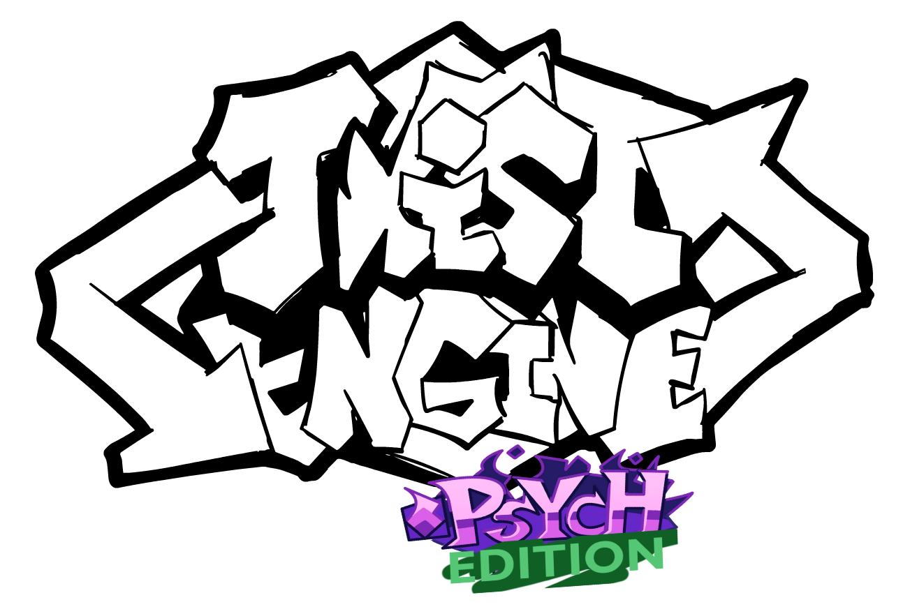

<h2 align="center" size="24">Friday Night Funkin' - Twist Engine ALPHA (Psych-Edition) </h2>

Engine originally used on [Friday Night Funkin' Colors Adventure](https://x.com/FNFCAdventure) mod.

**Attention:** editors have unfinished functionality.

### Supported platforms:
|        Windows       |        Linux        | Mac | Html  |   HashLink  |      Android      |
|:--------------------:|:-------------------:|:---:|:-----:|:-----------:|:-----------------:|
|  :heavy_check_mark:  | :heavy_check_mark:  | nah |  :wavy_dash:  | :wavy_dash: | :heavy_check_mark:|

## Installation:
To do this, use the appropriate setup file from the [setup folder](../master/setup).

## Credits:
* [Redar13](https://x.com/Redar13176784) - Main Programmer and Head of Twist Engine.
* [ItzRanbins](https://x.com/itz_ranbins) - CO-Main Director, concepter and sound director.
* [Psych Engine](https://github.com/ShadowMario/FNF-PsychEngine) - The basis for this version of the engine.

### Special Thanks
* [Lenya the cat](https://t.me/geroinpesherny) - Logo artist.
* [richTrash21](https://github.com/richTrash21) - Code assistance, helped improve Flixel and Psych Engine code.
* [PurSnake](https://github.com/PurSnake) - Code assistance.
* [Psenkos](https://x.com/Psenkoks) - Make design for Twist Tan mascot.
* [Sweet Mei](https://www.youtube.com/@SweetMeichka) - Helped with the design of Twist Tan.
* [TarnSpill](https://t.me/tarntoxicwaste) - Draw a pixelated app icon.
* [Sector](https://x.com/sectorrrb) - Helped with the port to Android.
* [Codename Engine Devs](https://github.com/CodenameCrew) - Improved hscript and some code.
* [FNF' Colors Adventure](https://x.com/FNFCAdventure) - The engine's progenitor.
* [5 Rubles 12 Kopecks](https://www.youtube.com/@5rubles_crew) - Development of the engine idea.